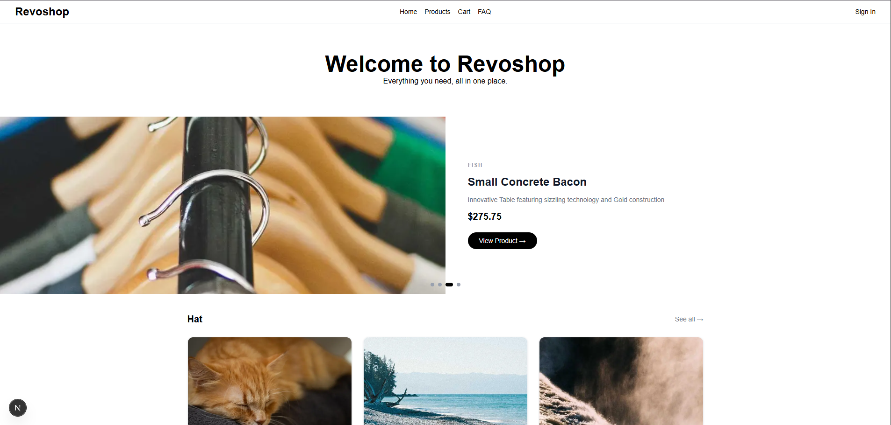
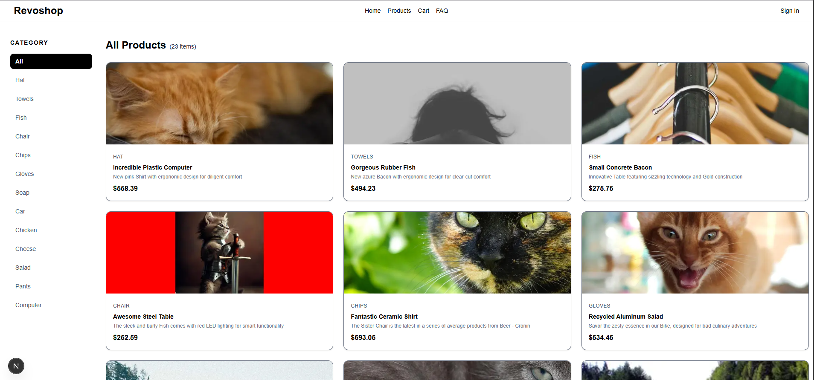
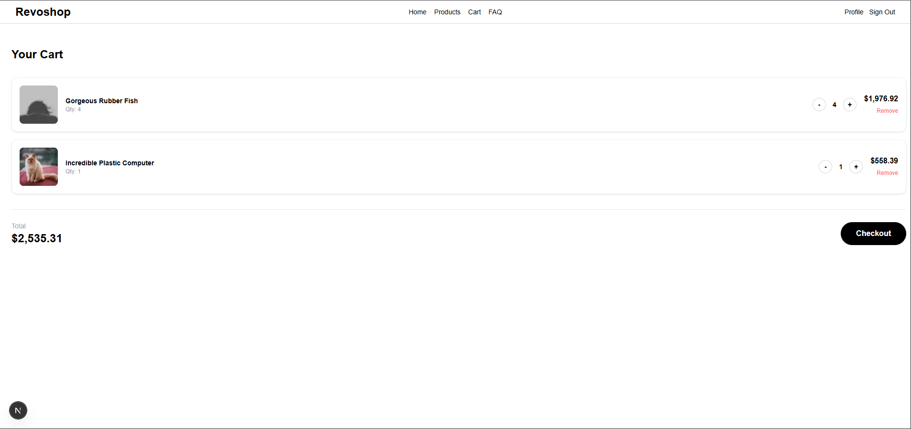
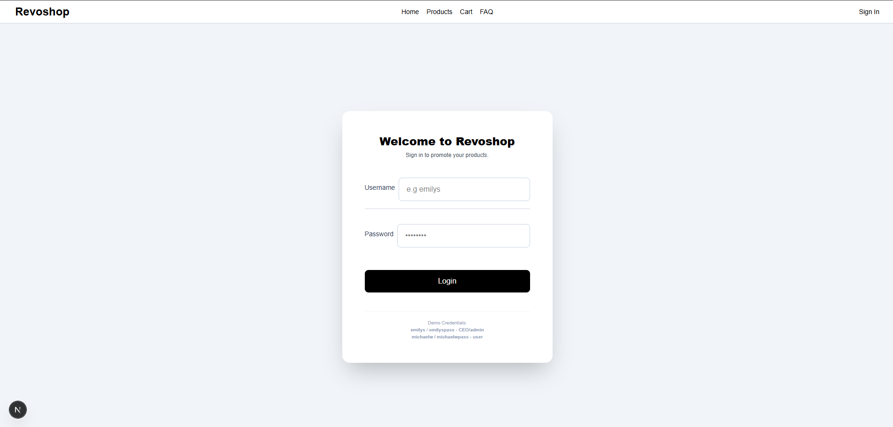
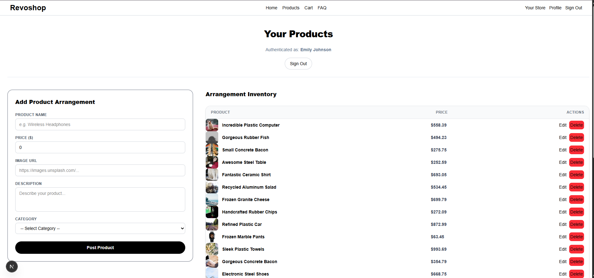
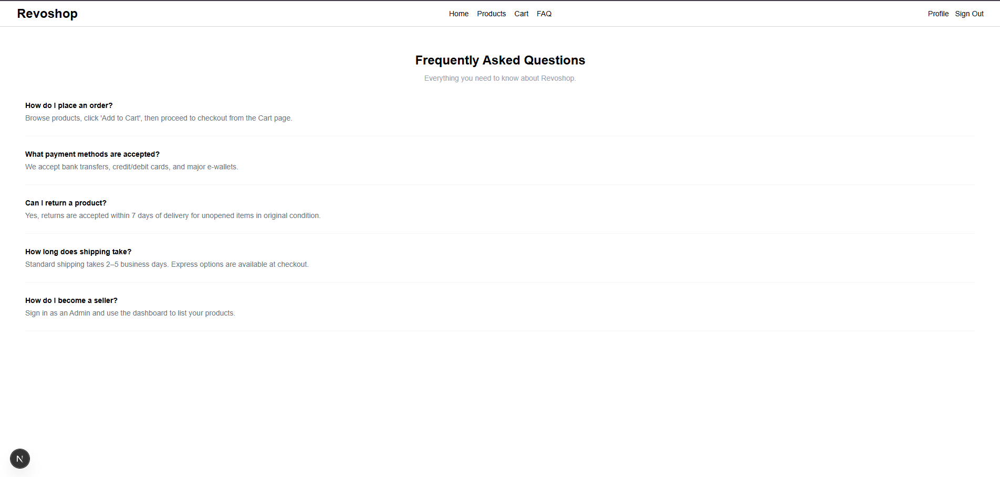
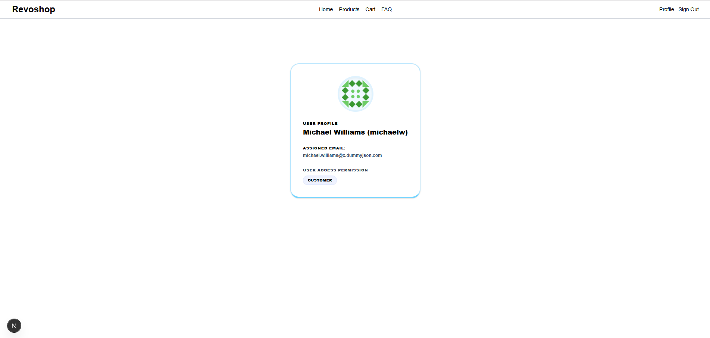

# Overview
Revoshop is a modern e-commerce web platform designed as a one-stop destination for high-quality products across multiple categories. The website allows users to easily browse and shop for a wide variety of items, ranging from electronics and fashion to home living and sports gear. In addition to being a marketplace for buyers, Revoshop also features a merchant ecosystem that empowers sellers to list their products, reach more customers, and grow their businesses online.

# Features Implemented
1. Home Page = Products are neatly organized into key categories such as Electronics, Fashion, Home & Living, and Sports, allowing users to browse items based on their specific interests.

2. Product Catalog (/products) = A dedicated page that displays available items for sale, integrated with category filters to help users find exactly what they are looking for.

3. Shopping Cart (/cart) = A functional cart system where users can view, manage, and temporarily store their selected items before proceeding to checkout.

4. User Authentication & Seller Portal (/login & /dashboard) = A secure login system for users that also provides access to the "Your Store" section, enabling thousands of sellers to register, set up their shops, and list products for sale.

5. FAQ Page (/faq) = A dedicated Frequently Asked Questions page designed to answer common customer inquiries, improve user experience, and build trust.

6. Profile page (/profile) = A page to show the user their basic information, including their full name, username, email, and their role in this system.

# Roles
There are 3 roles on this Revoshop that you can use to do some simulation:
1. Guest = no need to login  
notes: This user can only access Home Page and Product Catalog. If you want to explore more you should login to the other roles.

2. CEO = emilys (username) / emilyspass (password)
2. Customer = michaelw (username) / michaelwpass (password)  
notes: This user can access all of the features implemented, except for Seller Portal.

# Technology Used
- Frontend    : Next.js (Javascript, Typescript, Tailwind CSS, HTML)
- Backend     : MOCKAPI, DummyJson
- Deploy      : Netlify
- URL         : https://micelhiu-revoshop.netlify.app/
